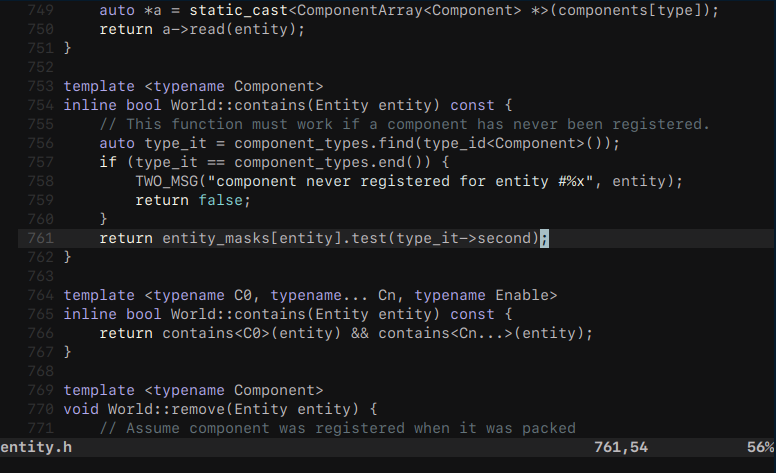
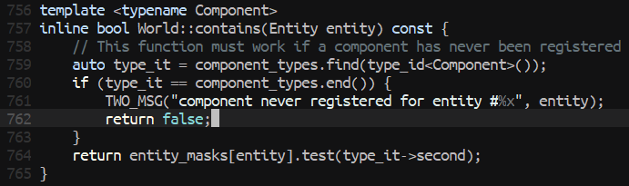

# vim-violet

A simple and cozy vim color scheme. Supports both true color and 256 color terminals.





## Installation

Place `nebula.vim` into your `~/.vim/colors` directory, or simply use a plug-in manager like [Plug](https://github.com/junegunn/vim-plug):

```VimL
Plug 'stillwwater/vim-violet'
```

## Usage

```VimL
syntax on

" enable true color (optional)
if has('termguicolors')
  set termguicolors
endif

" uncomment for blue background variant
" let g:violet_blue = 1

" uncomment for accent color (default is 'purple')
" let g:violet_accent = 'pink'
" let g:violet_accent = 'green'

colorscheme violet
```

## Contributing

Feel free to open a PR to improve highlighting for your language/plug-in.